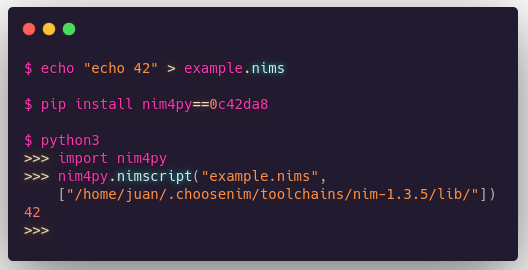

# Nim4Python

- [Nim](http://nim-lang.org) Interoperability for Python.
  A programming language embedded inside a programming language, installable via PIP. Pull Requests welcome.




# Install

- `pip install nim4py==0c42da8`


# Use

```console
$ echo 'echo "NimScript embedded on Python"' > file.nims

$ python
Python 3.8.5 (default, May 17 2020, 18:15:42) [GCC 10.1.0] on linux
>>> from nimscript4python import nimscript
>>> nimscript("file.nims", ["/home/juan/.choosenim/toolchains/nim-1.3.5/lib/"])
NimScript embedded on Python

>>>
```


[](https://www.youtube.com/watch?v=BdQkU_HepIg)


# Requisites

- [Nim](http://nim-lang.org) `1.3.5` or newer,
  [you can install it using choosenim_install directly from PIP.](https://github.com/juancarlospaco/choosenim_install#choosenim-integration-for-python-pip)


## TODO

- Return back directly from Nim to Python.


## FAQ

- Why ?.

It can be useful for some cool ideas, on Nim you do not have GIL, Garbage Collector, Virtual Machine, etc
but adds code execution at compile-time, powerful metaprogramming, you can "import" C/C++/JS Code and more,
maybe for plugins for a Python project or embedded scripting or similar ideas,
with option to compile to machine code binary or run in the browser or WebAssembly.

- What works of NimScript inside Python ?.

Everything if you pass **all** the standard library folder paths (?).

- Fails to find the NimScript file ?.

Use full path to the `.nims` file, it wont expand stuff like `~`, etc.

- Fails to find the stdlib folder ?.

Use full path to the stdlib folder, it wont expand stuff like `~`, etc.

- Whats NimScript ?.

https://nim-lang.github.io/Nim/nims.html
