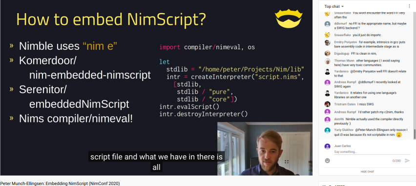

# NimScript4Python

- [NimScript](https://nim-lang.github.io/Nim/nims.html) Interoperability for Python.


```console
$ choosenim 1.2.2
Switched to Nim 1.2.2

$ cp --verbose patches/scriptconfig.nim ~/.nimble/pkgs/compiler-1.2.2/compiler/scriptconfig.nim  # Patched os.paramCount() to 0 and os.paramStr() to ""
'patches/scriptconfig.nim' -> '/home/juan/.nimble/pkgs/compiler-1.2.2/compiler/scriptconfig.nim'

$ nim c -d:release --app:lib --out:nimscript5python.so nimscript5python.nim
Hint: 9310 LOC; 20 sec; 300MiB peakmem; Dangerous build; proj: nimscript4python.nim; out: nimscript4python.so [SuccessX]

$ file nimscript4python.so
nimscript4python.so: ELF 64-bit LSB shared object, x86-64, not stripped

$ echo 'echo "NimScript embedded on Python!"' > file.nims

$ python
Python 3.8.3 (default, May 17 2020, 18:15:42) [GCC 10.1.0] on linux
>>> import nimscript4python
>>> nimscript4python.nimscript("file.nims", ["/home/juan/.choosenim/toolchains/nim-1.2.2/lib/"])
NimScript embedded on Python

```


[](https://www.youtube.com/watch?v=BdQkU_HepIg)


## FAQ

- What works of NimScript inside Python ?.

Everything if you pass **all** the standard library folder full paths (?).

- How ?, Why ?.

https://www.youtube.com/watch?v=BdQkU_HepIg

- Fails to find the NimScript file ?.

Use full path to the `.nims` file, it wont expand stuff like `~`, etc.

- Fails to find the stdlib folder ?.

Use full path to the stdlib folder, it wont expand stuff like `~`, etc.
